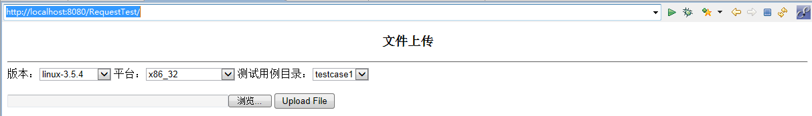

问题描述：
最初的界面如下：
 
期望用户通过下拉列表选择合适的选项并通过浏览按钮选择文件后，点击【Upload File】按钮，完成文件的上传。
但发现总是无法上传成功（下拉列表值获取为null）

问题分析：
HTML在发送表单数据前会对其进行编码，编码方式有以下三种：
<table>
<tr><td>值 </td><td>描述</td></tr>
<tr><td>application/x-www-form-urlencoded </td><td>在发送前编码所有字符（默认）</td></tr>
<tr><td>multipart/form-data </td><td>不对字符编码。在使用包含文件上传控件的表单时，必须使用该值。</td></tr>
<tr><td>text/plain</td><td>空格转换为 "+" 加号，但不对特殊字符编码。</td></tr>
</table>
若需要正确获得文本框、下拉列表等控件中的字符数据，需要使用“application/x-www-form-urlencoded” 或“text/plain”的编码方式。
若需要正确获得上传文件数据，需要使用“multipart/form-data”的编码方式。

若要将下拉列表中参数和上传文件参数同时放到一个表单中，表单只会选择一种编码方式对其中的数据进行编码。（即使使用HTML5<input 标签的formenctype属性将&lt;form&gt;标签的enctype属性覆盖也不行），因为按钮只有一个，服务器在接收请求后却不能智能地区别元素不同的编码方式，这样就导致了失败。

若以“application/x-www-form-urlencoded”或“text/plain”编码方式为基准，上传文件会识别为null；若以“multipart/form-data”编码方式为基准，下拉列表值会识别为null。
╮(╯_╰)╭或许……就像父母生了一个孩子，而这个孩子只会有一个性别，却不可能既是男孩又是女孩。

解决方案：
修改后的界面如下：
 
将原来的一个表单拆分为“选项”和 “文件”两个表单。选项表单中包括了用户选择的版本、平台和测试用例目录；文件表单中包含用户选择的测试文件。
在“选项”表单后增加【change】按钮。用户选择好下拉列表中的信息后，点击【change】按钮，将选择上传至服务器（使用JSP的内置session对象保存这些信息）。
	
在用户通过“文件表单”中的【浏览】按钮选择本地测试文件后，点击【Upload File】按钮，并通过session对象保存的参数信息，将文件上传到指定目录。
